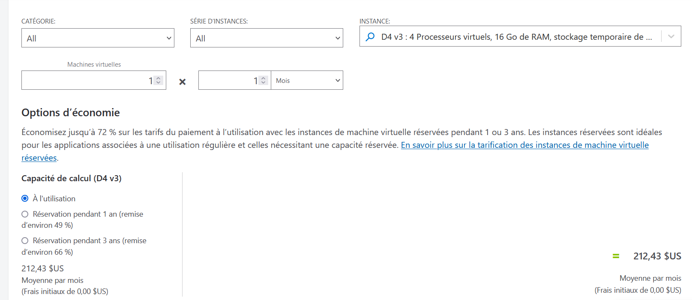
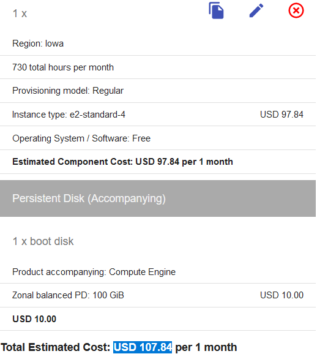
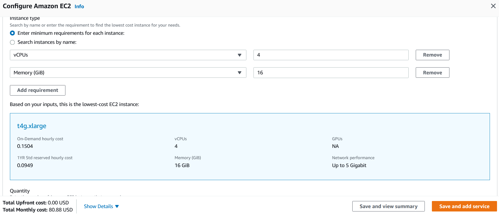
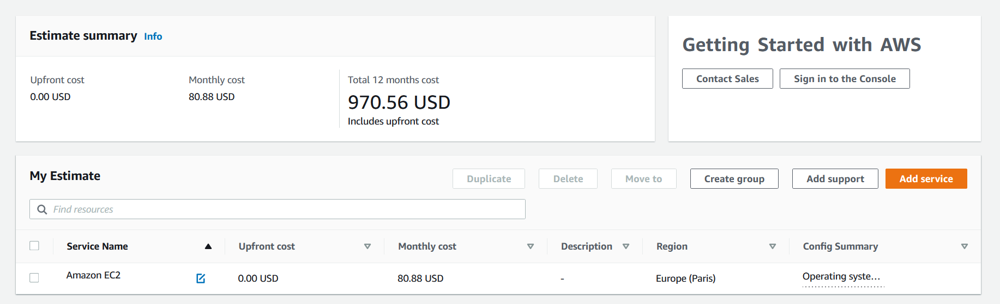
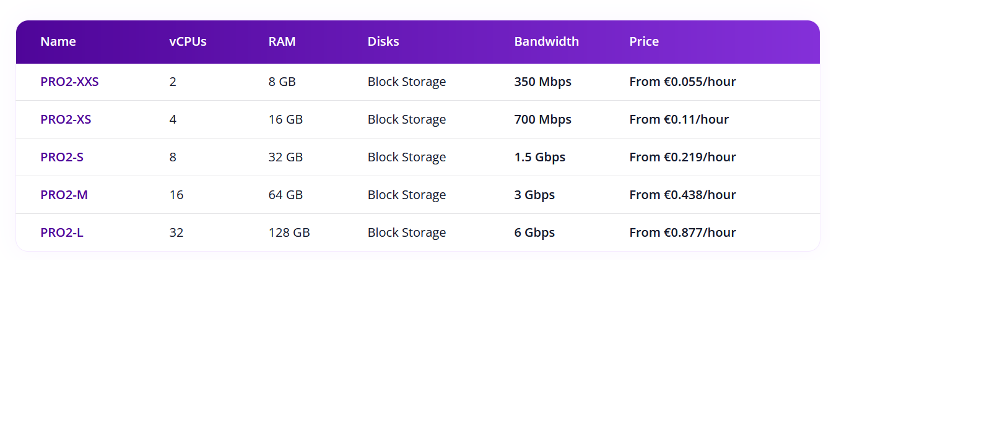

# Infrastructure n°1:
- 1 serveur avec les ressources suivantes :
- 16 Go de RAM minimum
- 4 vCPU
- 100 Go de stockage disque

Calcul horaire > mensuel : taux horaire x 24 x 365 / 12 

## Azure
### Offre 1 D4 v3 :

- Mensuel estimé : 212,43$

## GCP
### Offre e2-standard-4 :

- Mensuel estimé : 107.84$

## AWS
### Offre t4g.xlarge :

- Mensuel estimé :80.88 $

## Scaleway
### Offre PRO2-XS :

- Mensuel (lissé sur 12 mois) : 80€

# Infrastructure n°2:
- 6 serveurs avec les ressources suivantes :
- 6 Go de RAM minimum
- 3 vCPU
- 20 Go de stockage disque par serveur
- Particularité : 3 serveurs sont éteints la nuit de 22h à 6h du matin

## Azure
### Offre  A4 v2 :

- Mensuel estimé : 1 264,07 $

## GCP
### Offre  e2-standard-2:
- e2-standard-4 H16 : 273.94
- e2-standard-4 H24 : 410.91
- Mensuel estimé : 698.78  $

## AWS
###  t4g.xlarge:

- Mensuel total estimé : 429.58 $
- en mode reserved car les autres reviennent de toute façon plus cher.

## Scaleway
### Offre PLAY2-MICRO:

- Mensuel (lissé sur 12 mois) : 236,52€

# Infrastructure n°3:
- 3 serveurs avec les ressources suivantes :
- 4 Go de RAM minimum
- 2 vCPU
- 50 Go de stockage disque par serveur
- 1 load balancer qui répartit 5 Mb/s de données équitablement vers les 3 serveurs ci-dessus
- 1 service de base de données managé
- 8 Go de RAM minimum
- 2 vCPU

## Azure

### Offre A2 V2 :

- Mensuel estimé : 301,83$

### Offre Azure MySQL :

- Mensuel estimé : 129,05$

### Load balancer :

Gratuit

## GCP
### Offre e2-standard-2:

- Mensuel estimé : 692.77 $

### Offre Cloud Load Balancing (global) :

- Mensuel estimé : 21.35$

### Offre Alloy DB :

- Mensuel estimé : 327.77$

### Total : 1 041,89$

## AWS
### Offre t4g.medium :

- Mensuel estimé :  69.30$

### Offre Load balancing

- Mensuel estimé : 19.63

### Offre db.t3.medium :

- Mensuel estimé :  68.84$

### Total : 157,77$

## Scaleway
### Offre  PLAY2-NANO:

- Mensuel (lissé sur 12 mois) : 
  - Compute : 59,13€
  - Stockage : 2,92€

### Offre LB-GP-S:

- Mensuel (lissé sur 12 mois) : 
  - Compute : 10,22€
  - Stockage : 2,92€

### Offre DB-DEV-L:

- Mensuel (lissé sur 12 mois) : 
  - Compute :47,95€
  - Stockage : 0,584€

### Total : 123,73€