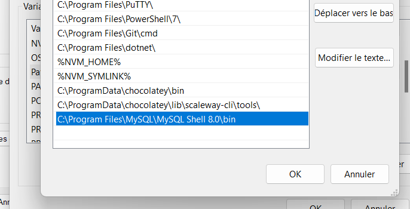

## Installation de chocolatey

```
Set-ExecutionPolicy Bypass -Scope Process -Force; [System.Net.ServicePointManager]::SecurityProtocol = [System.Net.ServicePointManager]::SecurityProtocol -bor 3072; iex ((New-Object System.Net.WebClient).DownloadString('https://community.chocolatey.org/install.ps1'))
```

## Installation du packet SCW

```
choco install scaleway-cli
```

## Connexion a SCW

```
scw init

Enter a valid access-key: SCWYJJHCEN******

Enter a valid secret-key: b3f2da2d-2dfc-4896-80d3-**************
```

## récupération de l'id de projet

```
curl https://api.scaleway.com/account/v1/tokens/SCWYJJHCEN3TR4P74NHG -H "X-Auth-Token:b3f2da2d-2dfc-4896-80d3-d9c399e501a6"
```

<!-- à corriger ? -->

## Création de l'instance

```
scw rdb instance create project-id=59972b2a-5ceb-447d-9266-ef00f9591ce1 name=rdom-pvig engine=MySQL-8 user-name=admin password=********** node-type=DB-DEV-S is-ha-cluster=false disable-backup=false volume-type=lssd backup-same-region=true region=fr-par

```

## Récuperation de l'id de base

```
scw rdb instance list

```

Output :

```
ID                                    NAME                       NODE TYPE  STATUS  ENGINE         REGION
b5562dfb-e4cb-4f44-9a8b-26c34c9842b5  db-cas1                    db-dev-s   ready   MySQL-8        fr-par
73497de8-0410-4d3a-b1cb-5ea831f0b04c  ihsan-nathan               db-gp-xs   ready   MySQL-8        fr-par
2017ab99-9e33-4c18-bd0b-f88c9ee1dbb9  DB-GRP-08                  db-gp-xs   ready   MySQL-8        fr-par
61978d47-7309-4aaa-8007-ef8a3f008d78  rdb-TP1                    db-dev-s   ready   MySQL-8        fr-par
76a5ff84-e6ca-43c4-bdaf-bc608bacdbfc  rdb-antoine-pierre         db-dev-s   ready   MySQL-8        fr-par
3240b18c-8626-42c5-a830-d3b6e1817ffc  tp1-database               db-gp-xs   ready   MySQL-8        fr-par
cf7a4076-6e88-42f0-83c3-cf6815d97316  rdb-valentin-clement       db-dev-s   ready   MySQL-8        fr-par
746fccd6-2c12-478f-a5c7-18630cb2c541  tp1-database               db-gp-xs   ready   MySQL-8        fr-par
67ddc204-7195-408f-906b-9fb6633a9d68  cli-ins-peaceful-rosalind  db-dev-s   ready   PostgreSQL-14  fr-par
a4c1ea04-e977-4c9d-9c8d-578f6b69ec27  rdb-cas1                   db-dev-s   ready   PostgreSQL-14  fr-par
48d36276-0238-4eb8-a148-aa1582740b0f  CloudinfraInstance-DB      db-dev-s   ready   MySQL-8        fr-par
a1b0a77f-85e5-4f4f-bc8c-e7d44c3d6412  db-tp-cas1                 db-gp-xs   ready   MySQL-8        fr-par
e150c726-4d27-42ad-973d-3f538f86b7e9  rdb-group9                 db-gp-xs   ready   MySQL-8        fr-par
e0b71969-c33a-4351-9bf0-d5d5727d12af  rdom-pvig                  db-dev-s   ready   MySQL-8        fr-par
```


## Création de la base

```
scw rdb database create instance-id=e0b71969-c33a-4351-9bf0-d5d5727d12af name=test
```

## Création de la table


<!-- ### Ajout de la variable d'environement MySQL



### Connexion à la base via CLI local
```
scw rdb instance connect e0b71969-c33a-4351-9bf0-d5d5727d12af database=test username=admin region=fr-par
``` -->
```
mysql -h 51.159.207.166 --port 32485 -p -u admin

USE test;
CREATE TABLE userpvig (
    nom varchar(255),
    prénom varchar(255),
    mail varchar(255 
);

SHOW TABLES;

+----------------+
| Tables_in_test |
+----------------+
| User           |
| userpvig       |
+----------------+
2 rows in set (0.02 sec)
```

## Création des utilisateurs    

```
INSERT INTO userpvig  VALUE 
('John','Roberts','john.roberts@ynov.com'),
('Billy','Bogus','billy.bogus@ynov.com'),
('Claude','Nuage','claude.nuage@ynov.com'),
('Jean','Phillipe','jean.phillipe@ynov.com');

SELECT * FROM userpvig; 
+--------+----------+------------------------+
| nom    | prénom   | mail                   |
+--------+----------+------------------------+
| John   | Roberts  | john.roberts@ynov.com  |
| Billy  | Bogus    | billy.bogus@ynov.com   |
| Claude | Nuage    | claude.nuage@ynov.com  |
| Jean   | Phillipe | jean.phillipe@ynov.com |
+--------+----------+------------------------+
4 rows in set (0.02 sec)
```


